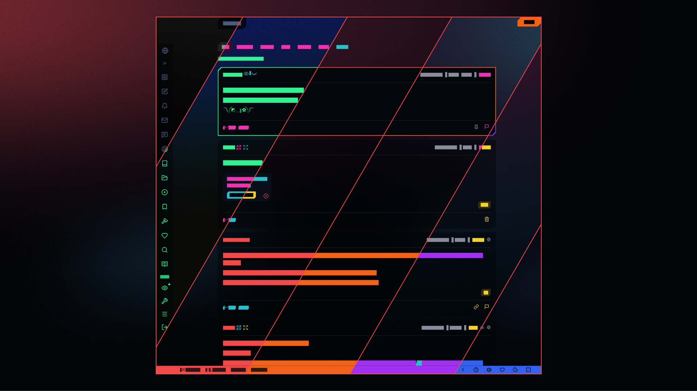
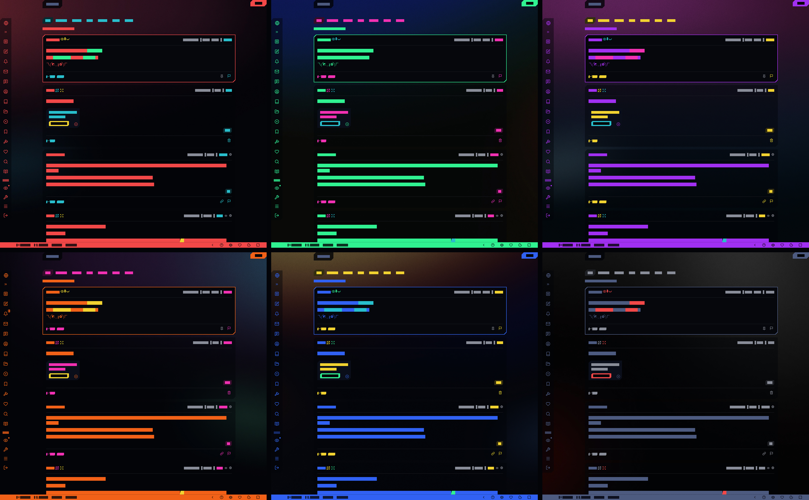

Cyberpunk theme for Cyberspace.online

# Showcase
## Pages

## Color options

# Options
- Change colors (primary, secondary, tertiary, link, hover)
- Change background image (12 + transparent)
- Change layouts (navigation, chat sidebar)
- Change font family
- Change font size

# Support
- Desktop Firefox
- Android Firefox
- Resolutions from 640x480 to 4k
- Looks nice on CRTs

# Steps
## 0. Before you start
- Download and install [Stylus](https://github.com/openstyles/stylus)

## 1. Install [theme](https://userstyles.world/style/25121/cyberspace-online)

## 2. Use
- You can either use the theme as is or you can change it:  
    1. Click on the Stylus icon in your browser toolbar  
    2. Click on the cogwheel next to the name of the theme  
    3. Pick your preferred options from dropdowns